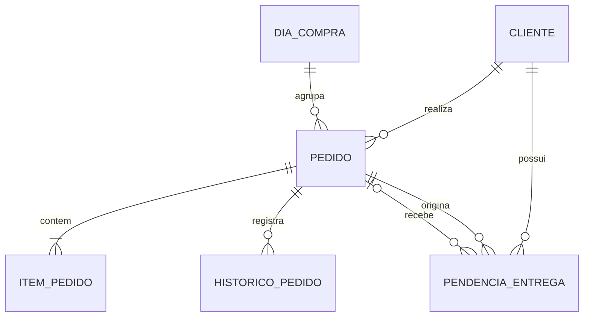
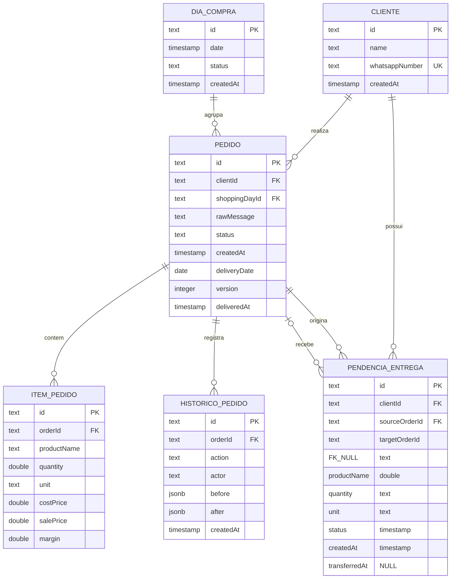

# HortiCurti - Modelagem de Banco de Dados

Documento baseado no `backend/prisma/schema.prisma` e nas migrações existentes em 16/09/2026.

## 1. MER conceitual



- Um cliente pode realizar nenhum ou vários pedidos; cada pedido pertence a um cliente.
- Um dia de compra pode agrupar nenhum ou vários pedidos; cada pedido pertence a um dia de compra.
- Um pedido possui um ou mais itens; cada item pertence a um pedido.
- Um pedido pode possuir vários registros de histórico; cada histórico pertence a um pedido.
- Uma pendência de entrega pertence a um cliente e ao pedido que a originou.
- Uma pendência pode ainda não ter destino ou ser transferida para um único pedido posterior.

## 2. DER físico



## 3. Modelo lógico relacional

```text
CLIENTE(
  id PK,
  nome,
  numero_whatsapp UK,
  criado_em
)

DIA_COMPRA(
  id PK,
  data,
  status,
  criado_em
)

PEDIDO(
  id PK,
  cliente_id FK -> CLIENTE.id,
  dia_compra_id FK -> DIA_COMPRA.id,
  mensagem_original,
  status,
  criado_em,
  data_entrega,
  versao,
  entregue_em NULL
)

ITEM_PEDIDO(
  id PK,
  pedido_id FK -> PEDIDO.id,
  nome_produto,
  quantidade,
  unidade,
  preco_custo NULL,
  preco_venda NULL,
  margem NULL
)

HISTORICO_PEDIDO(
  id PK,
  pedido_id FK -> PEDIDO.id,
  acao,
  autor,
  estado_anterior NULL,
  estado_posterior,
  criado_em
)

PENDENCIA_ENTREGA(
  id PK,
  cliente_id FK -> CLIENTE.id,
  pedido_origem_id FK -> PEDIDO.id,
  pedido_destino_id FK NULL -> PEDIDO.id,
  nome_produto,
  quantidade,
  unidade,
  status,
  criado_em,
  transferido_em NULL
)
```

## Regras de integridade

- `CLIENTE.numero_whatsapp` é único.
- As chaves estrangeiras são obrigatórias.
- A aplicação exige quantidades positivas e datas de entrega válidas.
- `PEDIDO.version` evita que alterações simultâneas sobrescrevam umas às outras.
- Os índices existentes cobrem data de entrega, situação/data da entrega e histórico por pedido.
- Pendências são criadas somente para quantidades faltantes escolhidas para reposição. Ao criar o próximo pedido do cliente, elas são transferidas e não carregam os preços do pedido anterior.
- O cancelamento do pedido de destino devolve a pendência ao estado `pending`.
- Há índices para consulta de pendências por cliente/status, pedido de origem e pedido de destino.

> O catálogo de produtos ainda está no código e o nome do produto é gravado tanto em `ITEM_PEDIDO` quanto em `PENDENCIA_ENTREGA`. A pendência guarda a quantidade e a unidade, mas recebe novos preços somente quando passa a integrar o próximo pedido.
